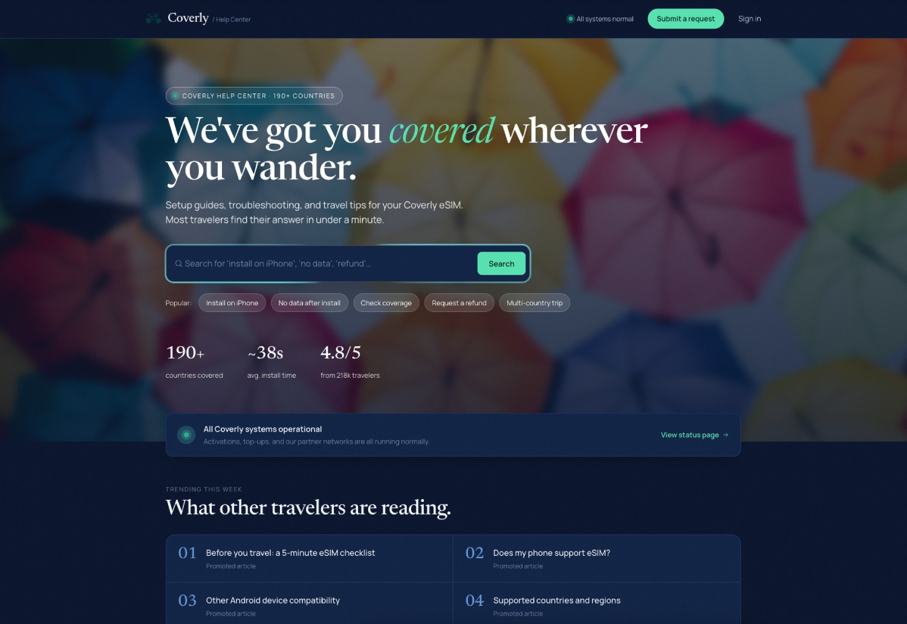

# Coverly Help Center Theme

Custom [Zendesk Guide](https://www.zendesk.com/service/help-center/) (Help Center) theme for [Coverly](https://coverly.com), the travel-eSIM brand. Dark editorial design with a Newsreader display heading + Manrope body, an animated search hero, twelve-category browse grid, a polished search-results page, and a custom-styled "Submit a request" demo form.

Built on top of the open-source [Copenhagen theme](https://github.com/zendesk/copenhagen_theme) (Zendesk's reference theme) — Copenhagen handles the Curlybars templating, Rollup build pipeline, React modules for complex UI surfaces (new-request form, request list, service catalog, approval requests, flash notifications), and the i18n + accessibility-testing tooling. Coverly replaces the templates, SCSS, and visual design while keeping the Copenhagen plumbing intact.

## Highlights

- Locked-in dark theme with cobalt / mint / navy palette (no admin-editable color settings — design is intentional and consistent).
- Newsreader (display) + Manrope (body) + JetBrains Mono (small editorial accents) via Google Fonts.
- Home, category, section, and article templates fully rewritten to match the Coverly design system.
- Custom hero search with animated conic-gradient glow, a Submit-a-request demo form, and search-results restyled with token-driven dark UI.
- All other Zendesk Guide pages (community, profile, requests, etc.) inherit the new palette via SCSS variable rebinding — no template surgery required.
- Conventions (icon dictionary, opt-in `.callout` / `.step-card` article classes, asset-variable pattern, etc.) documented in [AGENTS.md](./AGENTS.md).

## Quick start

```bash
yarn install
yarn start         # rollup -c -w + zcli themes:preview
```

`yarn start` requires Zendesk authentication (`yarn zcli login -i` first) and a working `zcli` profile for the target subdomain.

To produce a one-off production build without previewing:

```bash
yarn build         # rebuilds script.js, style.css, and assets/*-bundle.js
```

For the full build / preview / test command surface, see the **Common Commands** section in [AGENTS.md](./AGENTS.md).

## Repository layout

```
templates/      # Curlybars (.hbs) page templates — head/header/footer + each Help Center page
styles/         # SCSS partials compiled into style.css via Rollup + the bundled Zass plugin
src/            # Vanilla JS (script.js) and React modules (src/modules/) for complex UI surfaces
assets/         # Packaged theme assets (logo, hero photo) + Rollup-emitted module bundles
manifest.json   # Theme settings exposed in the Theming Center admin panel
translations/   # Theming-Center-translated strings for manifest labels
docs/           # Spec + plan documents from the migration
```

## What's different from Copenhagen

- **Manifest is trimmed** to Coverly-relevant settings: design tokens (colors / fonts) are hardcoded, not admin-editable.
- **Templates rewritten** for home, category, section, article + header / footer / `document_head`. Other templates kept on Copenhagen markup; they pick up the new palette automatically.
- **`{{search}}` helper replaced** in the hero with a custom `<form action="search">` so the placeholder copy and submit-button label match the design. Sub-nav search on inner pages still uses `{{search}}` (keeps autocomplete).
- **New-request page is a demo** — a static form that fakes submission and swaps to a "Your request has been submitted" success card. Not wired to Zendesk's real submission API.
- **`coverly-support-center/`** at the repo root is the Claude Design handoff bundle (HTML/CSS/JS mockups). It is gitignored and used only as a visual reference — it is not part of the shipped theme.

See [AGENTS.md](./AGENTS.md) for the full convention list (category icon dictionary, opt-in article body classes, Zass asset-variable pattern, out-of-scope-page styling policy).

## React modules

Complex UI surfaces (new-request form, request list, service catalog, approval requests, flash notifications) are React components in `src/modules/`, bundled as native ES modules by Rollup and loaded via the [import map](https://developer.mozilla.org/en-US/docs/Web/HTML/Element/script/type/importmap) emitted into `document_head.hbs`. The Garden theme provider reads color settings from `manifest.json` and applies them inside the modules so they pick up Coverly's palette.

If you add a new module, drop it into `src/modules/<name>/`, register its entry point in `rollup.config.mjs`, and the build will emit `assets/<name>-bundle.js` and add it to the import map automatically.

## Internationalization

Three separate translation surfaces, each with its own mechanism:

- **`translations.yml`** (repo root) — strings referenced by `manifest.json` settings labels/descriptions. Pulled into `translations/<locale>.json` via `yarn download-locales`.
- **`{{t 'key'}}` Curlybars helper** in templates — resolves keys that Zendesk Help Center exposes. New keys cannot be added by the theme; only the existing Zendesk-exposed set works.
- **React modules** — use `react-i18next` with YAML translation files under `src/modules/<module>/translations/`. Extract new strings with `yarn i18n:extract`; download new locales with `yarn i18n:update-translations`. The `--module=<name>` flag scopes both commands to a single module.

For new translation strings inside the React modules, the workflow and `i18next-parser` integration are unchanged from upstream Copenhagen.

## Accessibility testing

A custom Lighthouse-based audit script runs against either the local `zcli themes:preview` instance or a deployed Help Center.

```bash
yarn test-a11y -d      # against local preview (requires .a11yrc.json with admin creds)
yarn test-a11y         # against deployed Help Center (env vars: end_user_email, end_user_password, subdomain, urls)
```

Known issues that intentionally won't be fixed go into the ignore list in `bin/lighthouse/config.js`. See the inline comments there for the structure (audit id + path glob + selector).

## Contributing

This is a private fork. Use conventional commits — `semantic-release` reads them to compute the next version, generate `CHANGELOG.md`, and tag the release on merge to the default branch.

| Type | Effect |
|---|---|
| `feat` | minor release, listed under "Features" |
| `fix`, `perf`, `revert` | patch release |
| `chore`, `ci`, `docs`, `refactor`, `style`, `test`, `build` | no release, no changelog |
| Any type with `BREAKING CHANGE:` in the body/footer | major release |

Husky + commitlint enforce the format on commit. For more on the migration history and the design rationale, see the spec at `docs/superpowers/specs/2026-05-19-coverly-theme-design.md` and the implementation plan at `docs/superpowers/plans/2026-05-19-coverly-theme-migration.md`.

## License

Apache 2.0 — see [LICENSE](./LICENSE). Inherited from Copenhagen; Coverly's customizations are released under the same terms.
